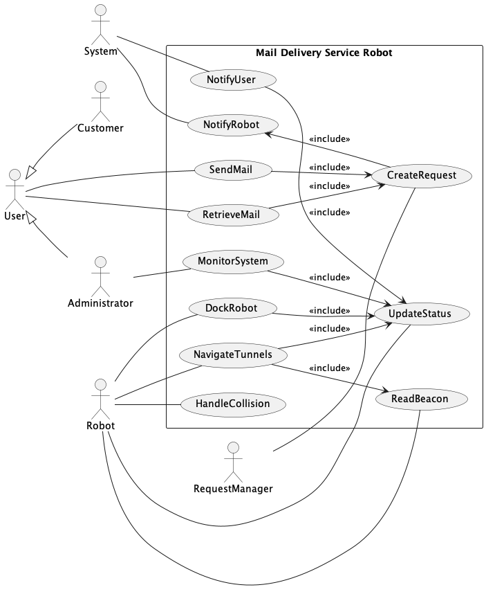
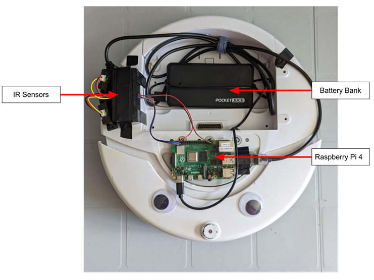
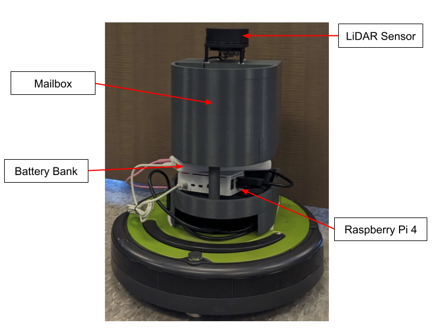
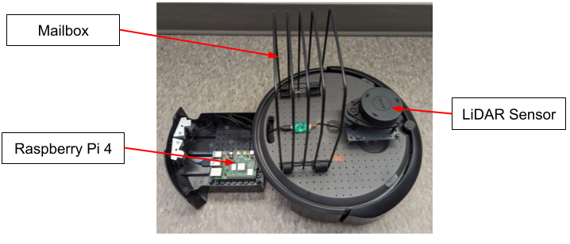
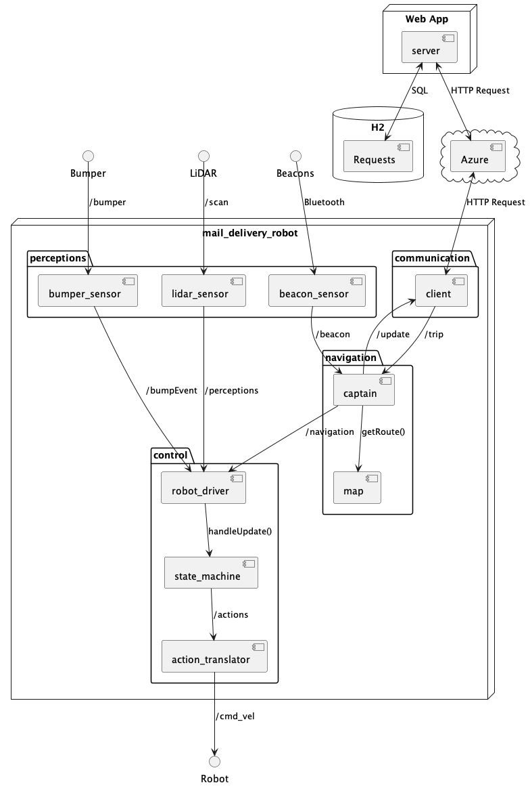

# Carleton Mail Delivery Robot System

Deployment Status: 

ROS Colcon Build Status:  

Web App Build Status: 

Diagram Generation Status: 

## Team Members
- [Max Curkovic](https://github.com/maxcurkovic)
- [Bardia Parmoun](https://github.com/bardia-p)
- [Matt Reid](https://github.com/MattReid6767)
- [Cassidy Pacada](https://github.com/cassidypacada)

## Description
This project is being completed to fulfill the 2023 - 2024 Capstone project requirements for SYSC 4907 at Carleton University.

The Carleton Mail Delivery Robot system aims to automate Carleton's existing mail deliver system. With the placement of several bluetoopth beacons throughout the tunnels, the robot will be able to navigate across Carleton using a LiDAR sensor.
For the purpose of this project, the robot's navigation system should allow it to reach its intended destination while detecting and avoiding any obstacles. The robot must be resilient and should be able to find its destination in the event
that it strays off its original course.
The system will be controlled through a web application component which will allow users to give the robot a desired destination.

  
  
A use case diagram summarizing the main features of the system

## Implementation

### Website
The website for the project is located at: https://cudelivery.azurewebsites.net/. Make sure to checkout our website to place new deliveries!

### Robots
Here is a summary of the hardware implementations of the project:
<table>
  <tr>
    <td>Iteration 1 using iRobot CREATE 1 (LEGACY)</td>
     <td>Iteration 2 using iRobot CREATE 2</td>
     <td>Iteration 3 using iRobot CREATE 3</td>
  </tr>
  <tr>
    <td></td>
    <td></td>
    <td></td>
  </tr>
 </table>

## Project Components
This project involves both software and hardware components. 

### Hardware Components
* an iRobot CREATE 2 or 3
* a 3D printed mailbox chassis to hold external components and mail
* a power bank
* a Raspberry Pi 4B to controls the robot's actions
* a LiDAR to provide environmental data for navigation
* 2 IR sensors (ONLY USED FOR CREATE 1)

### Software Components
* ROS 2 (Foxy or Humble) which is a set of libraries used to communicate with the robot
* the AutonomyLab create_robot repository which allows us to program the robot using Python (USED ONLY FOR CREATE 1 and 2)
* Slamtec Lidar Ros2 package to allow the robot to communicate with the LiDAR
* Spring Boot for the web application

## Project Design
The project is broken down into 2 major components:
* [ROS Backend](https://github.com/bardia-p/carleton-mail-delivery-robot/tree/master/mail_delivery_robot): this package includes all the code related to the ROS portion of the application
* [Web App](https://github.com/bardia-p/carleton-mail-delivery-robot/tree/master/webapp): this package includes all the code related to the web application portion of the project.

  
  
A component diagram summarizing the relationship between these packages.

For more detailed information about the design of the project please refer to the [Final Report](https://github.com/bardia-p/carleton-mail-delivery-robot/blob/master/documents/Final-Report_Autonomous-Mail-Delivery-Robot.pdf) and the [diagrams folder](https://github.com/bardia-p/carleton-mail-delivery-robot/tree/master/diagrams).

## Setting up the Project
For detailed instructions on how to set up the system please refer to Appendices B & C of the [Final Report](https://github.com/bardia-p/carleton-mail-delivery-robot/blob/master/documents/Final-Report_Autonomous-Mail-Delivery-Robot.pdf)

## Running the Project
For detailed instructions on how to run system please refer to Appendix D of the [Final Report](https://github.com/bardia-p/carleton-mail-delivery-robot/blob/master/documents/Final-Report_Autonomous-Mail-Delivery-Robot.pdf)

## Using the Project
1. Make sure the robots are all set up by following the "Setting up the Project" step.
2. Make sure the program is running on the robot.
3. Navigate to the [project website](https://cudelivery.azurewebsites.net/) and register the robot to the website (ONLY SUPER USERS CAN DO THIS ACTION.)
4. Click on the "Register" button if you do not have an account on the website.
5. Login to the website using your newly created account.
6. At the home page click on the "Launch a Delivery" button.
7. Once you have created your delivery, you can select it on the home page to track its status.

## Tools
To help with the development of the project, the team has created a few tools that allow for quick tests. The tools are as follows:
* [Beacon Analyzer](https://github.com/bardia-p/carleton-mail-delivery-robot/tree/master/tools/Beacon_Analyzer): This tool allows the developers to quickly measure the range and signal strength of the beacons and record them in a CSV file.
* [Wall Follow Simulator](https://github.com/bardia-p/carleton-mail-delivery-robot/tree/master/tools/Wall_Follow_Simulator): This tool allows the developers to test the wall following algorithm of the robot in a Turtle simulator.

## Other Iterations of the Project
As previously mentioned this is a continuious project. You can find the previous iterations of the project here for reference:
* [2022-2023](https://github.com/Em-kale/carleton-mail-delivery-robot)
* [2021-2022](https://github.com/SteveWick/carleton-mail-delivery-robot)

