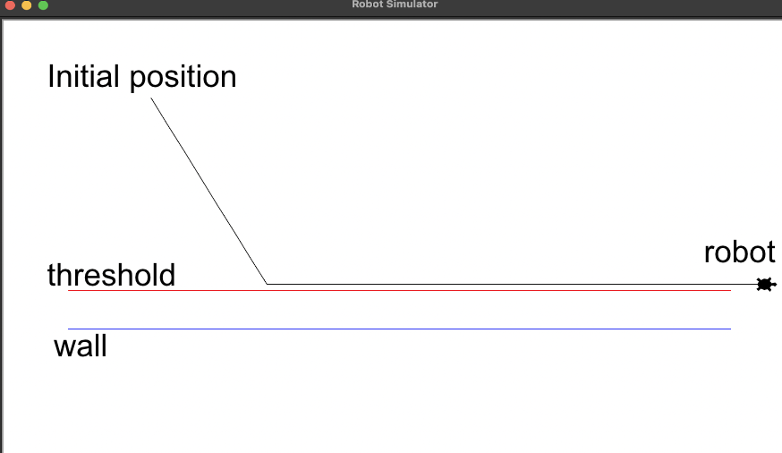

# Wall Following Simulator

The goal of this tool is to simulate the wall following logic that was implemented for the robot.

## Installing Tkinter

To use the application, please make sure that Tkinter has been installed on your system.

You can install Tkinter through the following command:

```
pip install tk
```

## Running the application

You can run the application by simply running the following command:

```
python3 wall_follow_sim.py
```

Once the simulator starts a window will appear which will look as follows:



## Using the application

The application has various variables that allow you to configure the robot's initial position, angle, and speed. You can also modify the robot's ideal distance with the wall. Here is a summary of those variables:

- **ROBOT_SPEED:** Determines the robot's speed throughout the simulator in m/s.
- **ROBOT_INITIAL_DISTANCE:** Determines the robot's initial distance from the wall in meters. 
- **ROBOT_INITIAL_ANGLE:** Determines the robot's initial angle with the wall in degrees.
- **SET_POINT:** Determines the robot's ideal distance with the wall.
- **AIM_ANGLE:** Determines the angle that the robot should maintain when heading towards the wall.